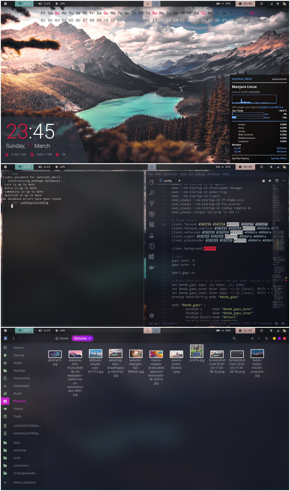

# i3-config

Here are the dot files for my desktop configuration.

# Install

Install the following application in your system :

* sweet-theme-git
* network-manager-applet-indicator
* i3-gaps
* compton-tryone-git
* nitrogen 
* polybar 
* rofi 
* ttf-font-awesome 
* adobe-source-code-pro-fonts
* ttf-yosemite-san-francisco-font-git
* termite 
* conky-lua 
* wal-git 
* xfce4-power-manager 
* clipit 
* xorg-xinput 
* xorg-xbacklight 
* pulseaudio 
* gnome-screenshot 
* lxappearance

-----------------------------------------------------------
## Screenshots

